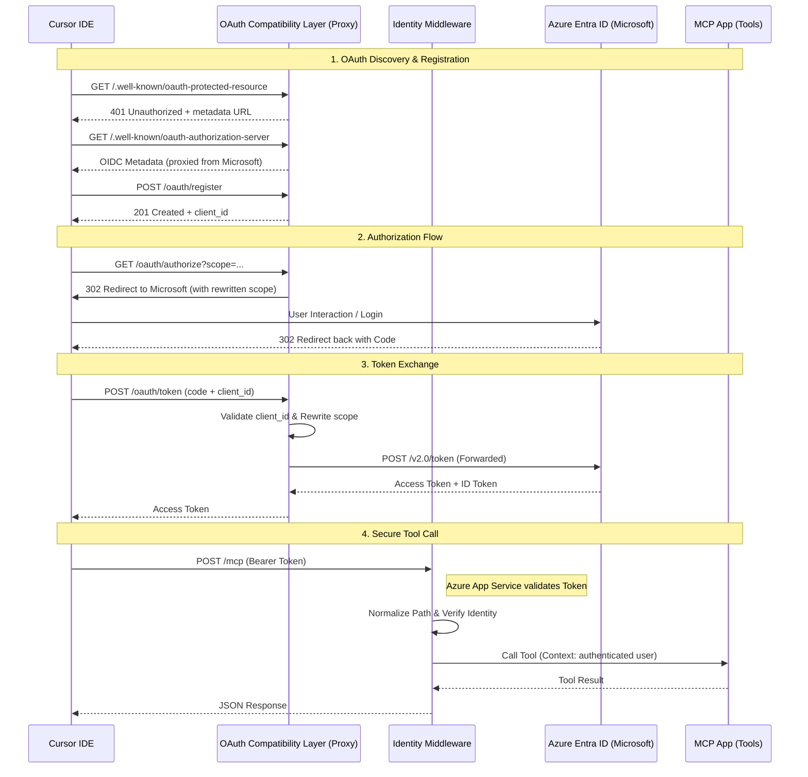

# MCP Server OAuth for Azure + Microsoft Entra ID

A complete guide and reference implementation for deploying MCP (Model Context Protocol) servers on Azure Container Apps with Microsoft Entra ID authentication, compatible with Cursor IDE.

## The Problem

The MCP specification requires OAuth support via RFC 8414, RFC 7591, and RFC 8707. Microsoft Entra ID doesn't support any of these. Cursor IDE (the primary MCP client) strictly enforces all of them. This repo provides the compatibility layer that bridges the gap.

## Who This Is For

- **Engineers** building MCP servers that will be deployed to Azure and accessed via Cursor IDE
- **AI coding agents** (Claude, GPT, etc.) operating in Cursor or similar IDEs, tasked with adding OAuth/Entra ID authentication to MCP servers

## What's In This Repo

```
docs/
├── README.md                          ← You are here
├── azure-mcp-oauth-guide.md           ← Step-by-step deployment guide
├── lessons-learned.md                 ← Gotchas, decision records, debugging playbook
└── reference/
    ├── oauth_compat.py                ← Drop-in OAuth compatibility layer
    ├── identity_middleware.py          ← Drop-in identity extraction middleware
    ├── example_server.py              ← Minimal wiring example
    └── requirements.txt               ← Python dependencies
```

### Start Here

| I want to... | Read this |
|---|---|
| Understand the architecture and set up from scratch | [azure-mcp-oauth-guide.md](azure-mcp-oauth-guide.md) |
| Know what went wrong and why, so I don't repeat it | [lessons-learned.md](lessons-learned.md) |
| Copy working code into my project | [reference/](reference/) |
| Debug a broken OAuth flow | [lessons-learned.md, Section 5](lessons-learned.md#5-the-debugging-playbook) |

## Quick Start

### 1. Prerequisites

- An Azure Container App with your MCP server deployed
- A Microsoft Entra ID app registration with:
  - Redirect URI: `cursor://anysphere.cursor-mcp/oauth/callback` (under "Mobile and desktop")
  - Exposed API scope: `access_as_user`
  - Public client flows: **Enabled**

### 2. Add the OAuth Layer to Your Server

Copy `reference/oauth_compat.py` and `reference/identity_middleware.py` into your project, then wire them in:

```python
from oauth_compat import OAuthCompatConfig, OAuthCompatEndpoints
from identity_middleware import IdentityMiddleware

# Get the Starlette app from your FastMCP server
app = mcp.streamable_http_app()

# Add middleware dynamically based on environment
import os
from identity_middleware import IdentityMiddleware

app = mcp.streamable_http_app()

if os.environ.get("RUNNING_IN_PRODUCTION") == "true":
    app.add_middleware(IdentityMiddleware)
else:
    from dev_middleware import DevIdentityMiddleware
    app.add_middleware(DevIdentityMiddleware)

# Add OAuth endpoints
config = OAuthCompatConfig.from_env()
oauth = OAuthCompatEndpoints(config)
# ... add_route calls ...
```

See [reference/example_server.py](reference/example_server.py) for a complete minimal example.

### 3. Configure Azure

```bash
# Set Easy Auth to AllowAnonymous (REQUIRED — see guide for why)
az containerapp auth update \
  --name <app> --resource-group <rg> \
  --unauthenticated-client-action AllowAnonymous

# Set environment variables
az containerapp update \
  --name <app> --resource-group <rg> \
  --set-env-vars \
    "OAUTH_RESOURCE_URL=https://<app>.azurecontainerapps.io" \
    "OAUTH_TENANT_ID=<tenant-id>" \
    "OAUTH_CLIENT_ID=<client-id>" \
    "OAUTH_ALLOWED_HOSTS=login.microsoftonline.com"
```

### 4. Configure Cursor

```json
{
  "mcpServers": {
    "your-server": {
      "url": "https://<app>.azurecontainerapps.io/mcp",
      "headers": {
        "Accept": "application/json, text/event-stream"
      }
    }
  }
}
```

### 5. Verify

```bash
# All five should succeed before testing in Cursor
curl -s https://<app>/health                                          # → 200
curl -s https://<app>/.well-known/oauth-protected-resource | jq .     # → 200
curl -s https://<app>/.well-known/oauth-authorization-server | jq .   # → 200
curl -s -X POST https://<app>/oauth/register \
  -H "Content-Type: application/json" \
  -d '{}' | jq .                                                      # → 201
curl -D - -X POST https://<app>/mcp                                   # → 401 + WWW-Authenticate
```

## AI Agent Instructions

If you are an AI agent tasked with adding Entra ID OAuth to an MCP server, read [lessons-learned.md, Section 8](lessons-learned.md#8-ai-agent-instructions) first. It contains:

- Pre-flight checklist (what to verify before writing code)
- Implementation checklist (exact order of operations)
- Common mistakes to avoid (7 specific DO NOTs)
- Testing sequence (verify in this exact order)

## How It Works (30-Second Version)

1.  **Discovery**: Your middleware returns 401 + metadata URL. Cursor fetches discovery docs.
2.  **Registration**: Cursor registers and gets a `client_id`.
3.  **Authorize**: Cursor redirects to `/oauth/authorize`. Your proxy rewrites scopes and 302s to Microsoft.
4.  **Token**: After user login, Cursor swaps the code for a token at `/oauth/token`. Your proxy validates the client and rewrites scopes.
5.  **MCP Call**: Cursor calls `/mcp`. Azure validates the token; your middleware validates the principal and path before calling the tool.

## Security Hardening

This implementation follows a **Deny by Default** approach tailored for MCP:

- **Strict Normalization**: Uses `posixpath.normpath` and leading-slash collapsing to block path traversal (e.g., `//mcp`).
- **SSRF Protection**: Strictly validates the upstream host. Configurable via `OAUTH_ALLOWED_HOSTS` for sovereign clouds (defaults to `login.microsoftonline.com`).
- **Client ID Enforcement**: Verifies the `client_id` in the token proxy to prevent impersonation.
- **Production Isolation**: Development bypass logic is strictly isolated in `dev_middleware.py`.

## Data Flow Diagram

The following diagram illustrates the interaction between Cursor, the Compatibility Layer, and Azure Entra ID.



## Source

GitHub: [azure-mcp-entra-id-oauth](https://github.com/mario-guerra/azure-mcp-entra-id-oauth)

## License

MIT
